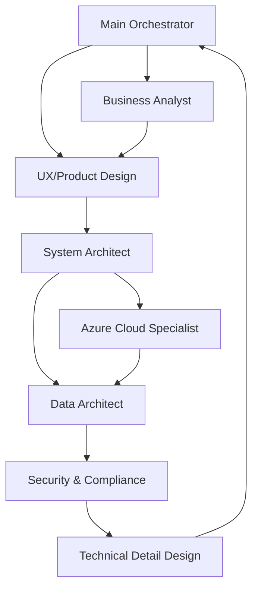

# Azure AI Foundry - Agent Service

## Description

## Demo

## Features

- feature:1
- feature:2

## Requirement

## Usage

## Installation/Tutorial

### Step 1: Azure CLI Login

To interact with Azure services, you need to log in using the Azure CLI. Open your terminal and run the following command:

```shell
az login
```

List your Azure subscriptions to ensure you have access:

```shell
az account list --output table
```

Set your desired subscription as the active one:

```shell
az account set --subscription "YOUR_SUBSCRIPTION_ID"
```

Show the current active subscription to confirm:

```shell
az account show --output table
```

### Step 2: Register Required Resource Providers

Before creating resources, you need to register the necessary Azure resource providers.

Run the following commands in your terminal:

```shell
# Microsoft.CognitiveServicesリソースプロバイダーの登録
az provider register --namespace Microsoft.CognitiveServices

# Microsoft.MachineLearningServicesリソースプロバイダーの登録（AI Foundryで使用）
az provider register --namespace Microsoft.MachineLearningServices

# Microsoft.Searchリソースプロバイダーの登録（検索機能用）
az provider register --namespace Microsoft.Search

# Microsoft.Storageリソースプロバイダーの登録（ストレージ用）
az provider register --namespace Microsoft.Storage

# Microsoft.DocumentDBリソースプロバイダーの登録（Cosmos DB用）
az provider register --namespace Microsoft.DocumentDB

# 登録状況の包括的確認
az provider show --namespace Microsoft.CognitiveServices --query "registrationState" --output tsv
az provider show --namespace Microsoft.MachineLearningServices --query "registrationState" --output tsv
az provider show --namespace Microsoft.Search --query "registrationState" --output tsv
az provider show --namespace Microsoft.Storage --query "registrationState" --output tsv
az provider show --namespace Microsoft.DocumentDB --query "registrationState" --output tsv
```

### Step 3: Create a Resource Group

Create a resource group to contain your Azure AI Foundry resources.

```shell
# 変数の設定
set resourceGroupName "rg-aifoundry-demo-"(date +%Y%m%d)
set location "eastus"

# リソースグループの作成
az group create --name $resourceGroupName --location $location

# 作成されたリソースグループの確認
az group show --name $resourceGroupName --output table
```

### Step 4: Create an Azure AI Foundry Account

Create an Azure AI Foundry account to start using the service.

```shell
set aiAccountName "ai-foundry-account-demo"

# Azure AI Foundryアカウントの作成（AIServices kind を使用）
az cognitiveservices account create \
    --name $aiAccountName \
    --resource-group $resourceGroupName \
    --location $location \
    --kind "AIServices" \
    --sku "S0" \
    --yes

# 作成されたアカウントの確認
az cognitiveservices account show \
    --name $aiAccountName \
    --resource-group $resourceGroupName \
    --output table
```

Show Endpoint and Access Keys:

```shell
# エンドポイントの取得
az cognitiveservices account show \
    --name $aiAccountName \
    --resource-group $resourceGroupName \
    --query "properties.endpoint" \
    --output tsv

# アクセスキーの取得
az cognitiveservices account keys list \
    --name $aiAccountName \
    --resource-group $resourceGroupName \
    --output table

# 利用可能なエンドポイント一覧の取得
az cognitiveservices account show \
    --name $aiAccountName \
    --resource-group $resourceGroupName \
    --query "properties.endpoints" \
    --output json
```

### Step 5: Create Supporting Resources

#### Create a Storage Account

Create a storage account to store data and models used by the Azure AI Foundry Agent Service.

```shell
# 変数の設定（短縮名 + 日付でユニークな名前を生成）
set storageAccountName "staifoundry"(date +%Y%m%d)

# Storage Accountの作成
az storage account create \
    --name $storageAccountName \
    --resource-group $resourceGroupName \
    --location $location \
    --sku "Standard_LRS" \
    --kind "StorageV2"

# Storage Accountの詳細確認
az storage account show \
    --name $storageAccountName \
    --resource-group $resourceGroupName \
    --output table
```

#### Create Azure Cosmos DB Account

Create an Azure Cosmos DB account to store structured data for the AI Foundry Agent Service.

```shell
# 変数の設定
set cosmosAccountName "cosmos-aifoundry-demo"

# 注意: East USで容量不足の場合は、別のリージョンを試してください
# 代替リージョンの例: westus2, centralus, westeurope
# set alternativeLocation "westus2"

# Option 1: 元のリージョン（eastus）で作成を試行
az cosmosdb create \
    --name $cosmosAccountName \
    --resource-group $resourceGroupName \
    --locations regionName=$location \
    --default-consistency-level "Session" \
    --enable-automatic-failover false

# Option 2: 容量不足の場合は代替リージョンを使用
# 前回の作成が失敗した場合は、まず既存のインスタンスを削除
# az cosmosdb delete \
#     --name $cosmosAccountName \
#     --resource-group $resourceGroupName \
#     --yes

# 削除完了を待ってから再作成
# set alternativeLocation "westus2"
# az cosmosdb create \
#     --name $cosmosAccountName \
#     --resource-group $resourceGroupName \
#     --locations regionName=$alternativeLocation \
#     --default-consistency-level "Session" \
#     --enable-automatic-failover false

# Cosmos DB Accountの確認
az cosmosdb show \
    --name $cosmosAccountName \
    --resource-group $resourceGroupName \
    --output table
```

#### Create Azure AI Search Service

Create Azure AI Search Service to enable search capabilities for your AI Foundry Agent Service.

```shell
# 変数の設定
set searchServiceName "search-aifoundry-demo"

# Azure AI Search Serviceの作成
az search service create \
    --name $searchServiceName \
    --resource-group $resourceGroupName \
    --location $location \
    --sku "Basic"

# Search Serviceの確認
az search service show \
    --name $searchServiceName \
    --resource-group $resourceGroupName \
    --output table
```

### Step 6: Create Supporting Services

#### Configure Permissions

#### Get Current User Object ID

```shell
# 現在のユーザーのオブジェクトIDを取得
set currentUser (az ad signed-in-user show --query id --output tsv)
echo "Current User ID: $currentUser"
```

#### Assign Roles

Assign the appropriate roles to the current user for the AI account.

```shell
# サブスクリプションIDの取得
set subscriptionId (az account show --query id --output tsv)

# Azure AI Administrator ロールをAIアカウントに付与
az role assignment create \
    --assignee $currentUser \
    --role "Azure AI Administrator" \
    --scope "/subscriptions/$subscriptionId/resourceGroups/$resourceGroupName/providers/Microsoft.CognitiveServices/accounts/$aiAccountName"

# 権限の確認
az role assignment list \
    --assignee $currentUser \
    --scope "/subscriptions/$subscriptionId/resourceGroups/$resourceGroupName" \
    --output table
```


### Step 7: Create an AI Agent using Azure AI Foundry Portal

Now that you have set up the required Azure resources, you can create an AI agent using the Azure AI Foundry Portal.

#### Prerequisites for Agent Creation

Before creating an agent, ensure you have the following:

1. **Required Azure Roles**:
   - **Azure AI Developer** role or **Azure AI User** role assigned at the project scope
   - Minimum required permissions: `agents/*/read`, `agents/*/action`, `agents/*/delete`

2. **Azure AI Foundry Project**:
   - An Azure AI Foundry Hub and Project must be created
   - A model (like GPT-4o) should be deployed

#### Step-by-Step Agent Creation Process

**Step 7.1: Access Azure AI Foundry Portal**

1. Navigate to [Azure AI Foundry Portal](https://ai.azure.com)
2. Sign in with your Azure credentials
3. If you're in a project, select "Azure AI Foundry" at the top left to go to the Home page

**Step 7.2: Create a New Project (if not already done)**

1. Click **"Create an agent"** for the fastest experience
2. Enter a name for your project (e.g., "AI-Agent-Demo-Project")
3. If you want to customize default values, select **"Advanced options"**
4. Select **"Create"**
5. Wait for resources to be provisioned:
   - An account and project will be created
   - The GPT-4o model will automatically be deployed
   - A default agent will be created

**Step 7.3: Configure Your AI Agent**

1. Once provisioning is complete, you'll land in the **Agent Playground**
2. In the left sidebar, navigate to **"Build and customize"** → **"Agents"**
3. Select **"+ New agent"** to create a new agent
4. Configure the following components:

   **Basic Configuration:**
   - **Agent Name**: Give your agent a descriptive name (e.g., "Customer Support Agent")
   - **Description**: Add a brief description of what your agent does
   - **Model Selection**: Choose your deployed model (GPT-4o is recommended)

   **System Instructions:**
   Add detailed instructions for your agent. Example:
   ```
   You are a helpful customer support agent for a technology company.
   You can answer questions about products, help with troubleshooting,
   and provide information about services. Always be polite, professional,
   and helpful. If you don't know something, admit it and offer to
   connect the customer with a human specialist.
   ```

   **Advanced Settings:**
   - **Temperature**: Adjust creativity (0.1 for more deterministic, 0.9 for more creative)
   - **Top P**: Control response diversity (0.1 for focused, 1.0 for diverse)

**Step 7.4: Add Tools and Capabilities**

Your agent can be enhanced with various tools:

1. **Code Interpreter**: Enable for data analysis and code execution
2. **Knowledge Sources**: Upload files or connect to Azure AI Search indexes
3. **Custom Functions**: Add Azure Functions for external integrations (via SDK)

**Step 7.5: Test Your Agent**

1. In the **Agent Playground**, start a conversation with your agent
2. Test various scenarios relevant to your use case
3. Verify that the agent responds appropriately to different types of questions
4. Test any uploaded knowledge sources by asking specific questions about the content

**Step 7.6: Deploy and Share**

1. Once satisfied with your agent's performance, you can:
   - Share the playground link with team members
   - Integrate the agent into applications using the Azure AI SDK
   - Export agent configuration for version control

#### Example Agent Scenarios

**Basic Customer Support Agent:**
```
System Instructions: "You are a customer support agent for an e-commerce platform.
Help customers with order inquiries, return policies, and product information.
Always ask for order numbers when relevant and provide clear, step-by-step guidance."
```

**Technical Documentation Assistant:**
```
System Instructions: "You are a technical documentation assistant. Help developers
understand API documentation, provide code examples, and troubleshoot integration issues.
Always reference official documentation and provide working code snippets when possible."
```

**HR Policy Assistant:**
```
System Instructions: "You are an HR assistant helping employees understand company
policies, benefits, and procedures. Provide accurate information from uploaded
policy documents and guide employees to appropriate resources or contacts."
```

#### Next Steps

After creating your basic agent:

1. **Enhance with RAG**: Upload company documents for knowledge grounding
2. **Add Custom Tools**: Integrate with external APIs using Azure Functions
3. **Monitor Performance**: Track agent conversations and improve instructions
4. **Scale Deployment**: Integrate into applications using the Azure AI SDK

### Step 8: Practical Multi-Agent System Design for Book-Related Service Launch

This section demonstrates how to create a comprehensive multi-agent system for developing a book-related service from business idea to implementation-ready detailed design. The system leverages Azure AI Foundry's Connected Agents feature to orchestrate specialized agents that collaborate throughout the development lifecycle.

#### Multi-Agent Architecture Overview

The system consists of 8 specialized agents working in a coordinated manner through a 3-phase workflow:

**Phase 1: Business Requirements Definition**
- Business analysis and market research
- User experience design and product requirements

**Phase 2: System Requirements Definition**
- Technical architecture and system design
- Azure cloud infrastructure planning
- Data architecture and security design

**Phase 3: Detailed Design**
- Security and compliance implementation
- Technical detailed design and API specifications
- Final integration and project planning

#### Required Agent Configuration

##### 1. **Main Orchestrator Agent**

**Role**: Project management and quality control

**Primary Functions**:
- Overall project progress management
- Task delegation to specialized agents
- Deliverable integration and quality assurance
- Stakeholder communication coordination
- Final detailed design document compilation

**System Instructions Template**:
```
You are the main orchestrator for a book-related service development project.
Your role is to manage the entire project lifecycle from business idea to
implementation-ready detailed design.

Responsibilities:
- Coordinate with 7 specialized agents through Connected Agents
- Ensure proper sequencing of work phases
- Integrate deliverables from all agents
- Maintain project quality standards
- Generate comprehensive project documentation

Working Process:
1. Analyze initial business requirements
2. Create project execution plan
3. Delegate tasks to appropriate specialist agents
4. Monitor progress and quality of each phase
5. Integrate all outputs into final deliverable

Output Format:
- Executive Summary
- Project Execution Plan
- Phase-wise Deliverable Integration
- Quality Assessment Report
- Implementation Roadmap
```

**Configuration**:
- **Model**: GPT-4o
- **Temperature**: 0.3 (Deterministic for consistency)
- **Top P**: 0.8
- **Tools**: Connected Agents, Code Interpreter

---

##### 2. **Business Analyst Agent**

**Role**: Business requirements definition and market analysis

**Primary Functions**:
- Transform business ideas into formal business requirements
- Conduct comprehensive market research and competitive analysis
- Design business model canvas and revenue models
- Perform stakeholder analysis
- Create detailed business requirement documents

**System Instructions Template**:
```
You are a specialized business analyst for book-related services with deep
expertise in the reading and publishing industry market.

Core Competencies:
- Reading industry market analysis and trends
- Competitive landscape assessment
- Business model design and revenue optimization
- Customer segmentation and persona development
- Stakeholder mapping and requirement analysis

Analysis Framework:
1. Market size and growth potential assessment
2. Competitive analysis matrix creation
3. Customer journey mapping
4. Revenue model evaluation
5. Business case development

Deliverables:
- Executive Summary
- Market Analysis Report (with data visualization)
- Competitive Analysis Matrix
- Business Model Canvas
- Detailed Business Requirements Document
- ROI Projections and Financial Model
```

**Configuration**:
- **Model**: GPT-4o
- **Temperature**: 0.5 (Balanced creativity for market insights)
- **Top P**: 0.9
- **Tools**: Bing Search, Code Interpreter
- **Dependencies**: Main Orchestrator

---

##### 3. **UX/Product Design Agent**

**Role**: User experience design and product requirements definition

**Primary Functions**:
- Create detailed user personas and journey maps
- Define UI/UX requirements and design guidelines
- Specify detailed functional requirements
- Develop user stories and acceptance criteria
- Create prototype specifications

**System Instructions Template**:
```
You are a UX/Product Design specialist focused on reading and book-related
digital experiences. Your expertise covers user research, interaction design,
and product requirement definition.

Design Philosophy:
- User-centered design approach
- Mobile-first responsive design
- Accessibility and inclusive design principles
- Data-driven design decisions

Core Activities:
1. User research and persona development
2. User journey mapping and pain point analysis
3. Information architecture and wireframing
4. Functional requirement specification
5. Prototype and testing plan creation

Deliverables:
- User Persona Definitions (3-5 detailed personas)
- User Journey Maps
- Functional Requirements Document
- UI/UX Guidelines and Design System
- Prototype Specifications
- User Testing Plan
```

**Configuration**:
- **Model**: GPT-4o
- **Temperature**: 0.7 (Higher creativity for design innovation)
- **Top P**: 0.9
- **Tools**: Code Interpreter, File Search
- **Dependencies**: Business Analyst

---

##### 4. **System Architect Agent**

**Role**: System architecture and technical design

**Primary Functions**:
- Transform business requirements into system requirements
- Design overall system architecture and components
- Define technology stack and service selection
- Specify non-functional requirements
- Create integration and API design specifications

**System Instructions Template**:
```
You are a senior system architect specializing in cloud-native, scalable
applications for content and community platforms.

Technical Expertise:
- Enterprise architecture patterns
- Microservices and API-first design
- Cloud-native application design
- Scalability and performance optimization
- Integration architecture

Architecture Principles:
1. Scalability and elasticity
2. Resilience and fault tolerance
3. Security by design
4. Cost optimization
5. Maintainability and extensibility

Deliverables:
- System Requirements Document
- Technical Architecture Diagram
- Service Component Design
- Non-Functional Requirements Specification
- Integration Architecture Document
- Technology Stack Recommendation
```

**Configuration**:
- **Model**: GPT-4o
- **Temperature**: 0.4 (Structured approach for architecture)
- **Top P**: 0.8
- **Tools**: Azure AI Search, Code Interpreter
- **Dependencies**: UX/Product Design

---

##### 5. **Azure Cloud Specialist Agent**

**Role**: Azure-specific technical selection and design

**Primary Functions**:
- Select optimal Azure services and configurations
- Apply Azure Well-Architected Framework best practices
- Design cost optimization strategies
- Implement security and compliance requirements
- Create scalability and availability designs

**System Instructions Template**:
```
You are an Azure cloud architect with extensive experience in implementing
content platforms and community services on Microsoft Azure.

Azure Expertise:
- Azure Well-Architected Framework implementation
- Azure service selection and optimization
- Cost management and billing optimization
- Azure security and compliance services
- DevOps and automation with Azure

Design Approach:
1. Service selection based on requirements and constraints
2. Cost-benefit analysis for different configurations
3. Security and compliance implementation
4. Monitoring and operational excellence setup
5. Disaster recovery and business continuity planning

Deliverables:
- Azure Service Selection Rationale
- Azure Architecture Diagram
- Cost Estimation and Optimization Plan
- Security and Compliance Design
- Operations and Monitoring Plan
- Disaster Recovery Strategy
```

**Configuration**:
- **Model**: GPT-4o
- **Temperature**: 0.3 (Precise for technical recommendations)
- **Top P**: 0.8
- **Tools**: Azure AI Search, Bing Search
- **Dependencies**: System Architect

---

##### 6. **Data Architect Agent**

**Role**: Data design and database architecture

**Primary Functions**:
- Design logical and physical data models
- Create database schema and optimization strategies
- Design data flow and ETL processes
- Implement data integration and API designs
- Ensure data security and privacy compliance

**System Instructions Template**:
```
You are a data architect specializing in content management, user-generated
data, and recommendation systems for reading platforms.

Data Expertise:
- Relational and NoSQL database design
- Data modeling and schema optimization
- Data pipeline and ETL design
- Real-time analytics and reporting
- Data privacy and GDPR compliance

Design Methodology:
1. Logical data model creation
2. Physical database design and optimization
3. Data flow and integration design
4. Performance tuning and indexing strategy
5. Data governance and security implementation

Deliverables:
- Logical Data Model (ERD)
- Physical Database Design Document
- Data Flow Diagrams
- ETL/Data Pipeline Design
- Data Governance and Privacy Plan
- Performance Optimization Strategy
```

**Configuration**:
- **Model**: GPT-4o
- **Temperature**: 0.4 (Structured for data design)
- **Top P**: 0.8
- **Tools**: Code Interpreter, Azure AI Search
- **Dependencies**: Azure Cloud Specialist

---

##### 7. **Security & Compliance Specialist Agent**

**Role**: Security design and regulatory compliance

**Primary Functions**:
- Define comprehensive security requirements
- Design personal data protection and privacy measures
- Create authentication and authorization systems
- Ensure regulatory compliance (GDPR, privacy laws)
- Perform risk analysis and mitigation planning

**System Instructions Template**:
```
You are a cybersecurity and compliance specialist with expertise in content
platforms, user data protection, and international privacy regulations.

Security Expertise:
- Application security and threat modeling
- Identity and access management
- Data protection and privacy engineering
- Compliance frameworks (GDPR, CCPA, etc.)
- Security monitoring and incident response

Compliance Focus:
1. Personal data protection and privacy by design
2. Regulatory compliance mapping
3. Security control implementation
4. Risk assessment and mitigation
5. Audit and monitoring requirements

Deliverables:
- Security Requirements Document
- Privacy Impact Assessment
- Authentication & Authorization Design
- Compliance Framework Mapping
- Risk Assessment and Mitigation Plan
- Security Monitoring and Incident Response Plan
```

**Configuration**:
- **Model**: GPT-4o
- **Temperature**: 0.2 (Highly structured for security)
- **Top P**: 0.7
- **Tools**: Azure AI Search, Bing Search
- **Dependencies**: Data Architect

---

##### 8. **Technical Detail Design Agent**

**Role**: Implementation-ready detailed design

**Primary Functions**:
- Create comprehensive API specifications (OpenAPI)
- Design detailed component implementations
- Specify database detailed design and procedures
- Define error handling and exception management
- Create comprehensive testing specifications

**System Instructions Template**:
```
You are a senior software architect responsible for creating implementation-ready
technical documentation that development teams can directly use for coding.

Technical Expertise:
- API design and OpenAPI specification
- Software component design patterns
- Database implementation and optimization
- Error handling and resilience patterns
- Test-driven development and quality assurance

Documentation Standards:
1. API specifications with complete request/response examples
2. Detailed component design with interfaces
3. Database scripts and migration plans
4. Comprehensive error handling specifications
5. Unit, integration, and system test plans

Deliverables:
- OpenAPI 3.0 Specification Document
- Detailed Technical Design Document
- Database Implementation Scripts
- Error Handling and Exception Design
- Comprehensive Test Plan and Test Cases
- Implementation Guidelines and Best Practices
```

**Configuration**:
- **Model**: GPT-4o
- **Temperature**: 0.3 (Precise for implementation details)
- **Top P**: 0.8
- **Tools**: Code Interpreter, OpenAPI Tools
- **Dependencies**: Security & Compliance Specialist

#### Agent Collaboration Flow



#### Expected Deliverables

Upon completion, the multi-agent system will produce:

1. **Business Requirements Package**
   - Market analysis report with data visualizations
   - Competitive analysis matrix
   - Business model canvas and revenue projections

2. **User Experience Package**
   - User personas and journey maps
   - Functional requirements specification
   - UI/UX guidelines and prototype specifications

3. **Technical Architecture Package**
   - System architecture diagrams
   - Azure service configuration and cost estimates
   - Data models and database design

4. **Security & Compliance Package**
   - Security requirements and risk assessments
   - Privacy impact assessment and GDPR compliance plan
   - Authentication and authorization specifications

5. **Implementation Package**
   - Complete OpenAPI specifications
   - Detailed technical design documents
   - Comprehensive test plans and implementation guidelines

#### Implementation in Azure AI Foundry

1. **Create each agent** with the specified configurations in Azure AI Foundry Portal
2. **Configure Connected Agents** to establish the dependency relationships
3. **Test individual agents** with component-specific prompts
4. **Execute full workflow** using the comprehensive test prompts provided in [`test_prompts.md`](./test_prompts.md)
5. **Validate deliverables** against the success criteria and quality standards

This multi-agent system transforms a simple business idea into a comprehensive, implementation-ready project plan that development teams can immediately execute.

## References

## Licence

Released under the [MIT license](https://gist.githubusercontent.com/shinyay/56e54ee4c0e22db8211e05e70a63247e/raw/f3ac65a05ed8c8ea70b653875ccac0c6dbc10ba1/LICENSE)

## Author

- github: <https://github.com/shinyay>
- twitter: <https://twitter.com/yanashin18618>
- mastodon: <https://mastodon.social/@yanashin>
